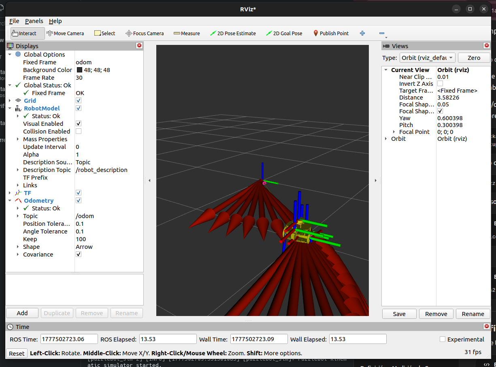

El flujo general del sistema es:

```text
/cmd_vel → puzzlebot_sim → /wr /wl
/wr /wl → localisation → /odom
/odom → joint_state_pub → /tf + /joint_states
/odom → point_stabilisation_control → /cmd_vel
```

## Cómo correr el mini challenge

Primero entra al workspace del repo:

```bash
cd ~/ros2_ws/puzzlebot-pallet-loader
```

Compila el paquete de ROS 2:

```bash
colcon build --packages-select puzzlebot_sim
```

Carga el workspace:

```bash
source install/setup.bash
```

Corre la simulación completa:

```bash
ros2 launch puzzlebot_sim puzzlebot_sim_launch.py
```

Este launch abre RViz y corre los nodos principales del sistema:

```text
robot_state_publisher
puzzlebot_sim
localisation
joint_state_pub
point_stabilisation_control
rviz2
```

## Configuración en RViz

En RViz, usar:

```text
Fixed Frame: odom
```

Activar los displays:

```text
Grid
RobotModel
TF
Odometry
```

En `Odometry`, seleccionar el tópico:

```text
/odom
```

## Cambiar objetivo

El objetivo se cambia en:

```text
src/mini_challenge3/puzzlebot_sim/point_stabilisation_control.py
```

Modificar estas líneas:

```python
self.goal_x = 1.0
self.goal_y = 0.0
self.goal_theta = 0.0
```

Por ejemplo, para probar un objetivo con giro:

```python
self.goal_x = 1.0
self.goal_y = 1.0
self.goal_theta = 0.0
```

Después de cambiar el objetivo, volver a compilar y correr:

```bash
colcon build --packages-select puzzlebot_sim
source install/setup.bash
ros2 launch puzzlebot_sim puzzlebot_sim_launch.py
```

## Resultado en RViz

