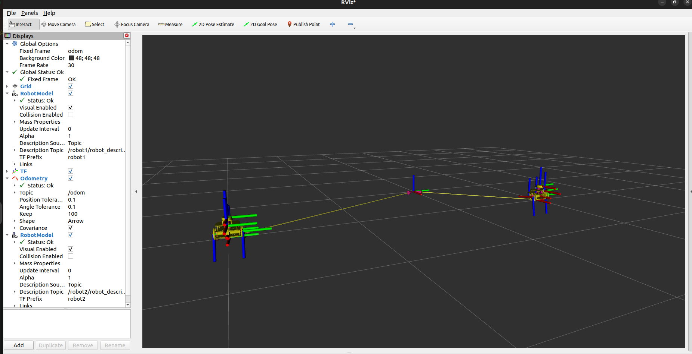

# Puzzlebot Pallet Loader - Mini Challenge 4

Este repositorio contiene la solución al **Mini Challenge 4**, el cual consiste en la simulación y control de múltiples robots Puzzlebot utilizando **ROS 2**, **namespaces**, **TF** y **RViz2**.

## Descripción del Desafío

El objetivo principal de este reto es simular dos robots móviles de tracción diferencial de forma independiente. Cada Puzzlebot cuenta con su propio simulador cinemático, nodo de localización, publicador de `joint_states` y controlador de estabilización hacia un punto objetivo.

Para evitar conflictos entre tópicos y frames, se utilizan namespaces:

- `robot1`
- `robot2`

El flujo general de cada robot es:

- **Simulación Cinemática:** Recibe comandos de velocidad (`cmd_vel`) y calcula las velocidades de las ruedas (`wr`, `wl`).
- **Localización:** Calcula la odometría (`odom`) mediante *dead reckoning* usando las velocidades de las ruedas.
- **TF y Joint States:** Publica la transformación entre `odom` y el frame del robot, además del estado de las ruedas para visualizar el modelo en RViz.
- **Control de Posición:** Usa la odometría para mandar comandos de velocidad y mover cada robot hacia su propio objetivo.

## Resultado de la Simulación

<div align="center">
  
</div>

## ¿Cómo ejecutar la simulación?

1. Entra al workspace:

```bash
cd ~/ros2_ws/puzzlebot-pallet-loader
colcon build --packages-select mini_challenge4
source install/setup.bash
ros2 launch mini_challenge4 puzzlebot_sim_launch.py
>>>>>>> 125618574b26759b3e32805f2e3f7c1db64c3df9
